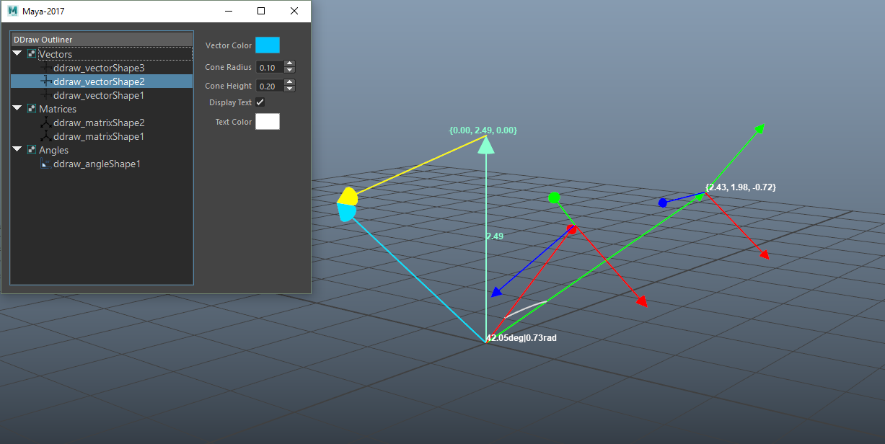

# Debug-Draw

## Contents
This repository contains a Maya module for easily debuging your node graph. This helps to quickly visualize your nodes and helps you in the debuggin process when working with a lot of math nodes including vectors and matrices.
## Module Contents
### MpxLocators
Currently they only work in Viewport 2.0
* ddraw_vector
* ddraw_matrix
* ddraw_angle
### Python script
Includes a markin menu for the node editor and a simple UI for managing and batch editing the debug objects.
